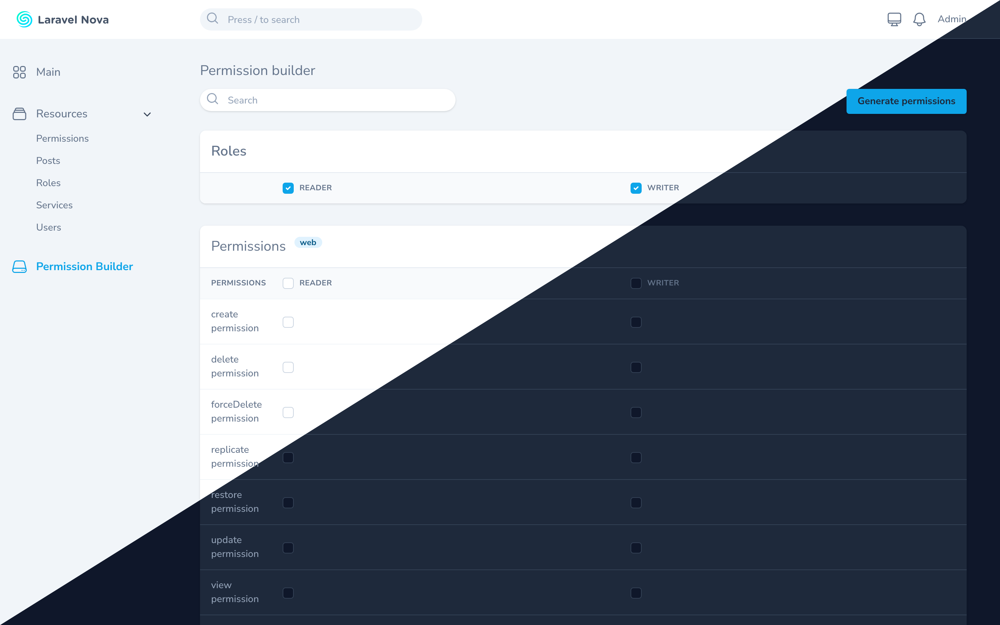
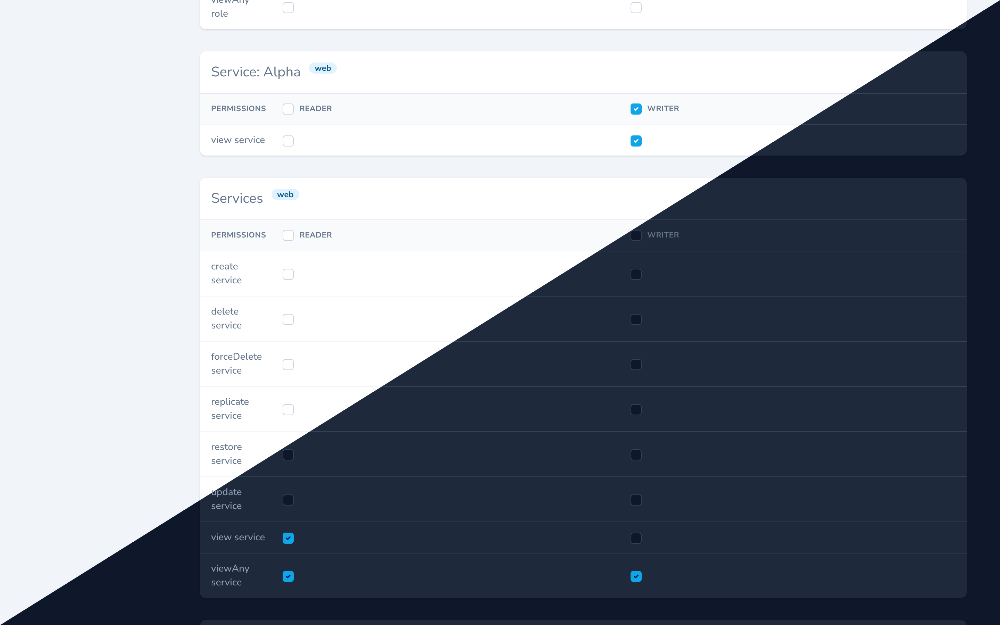
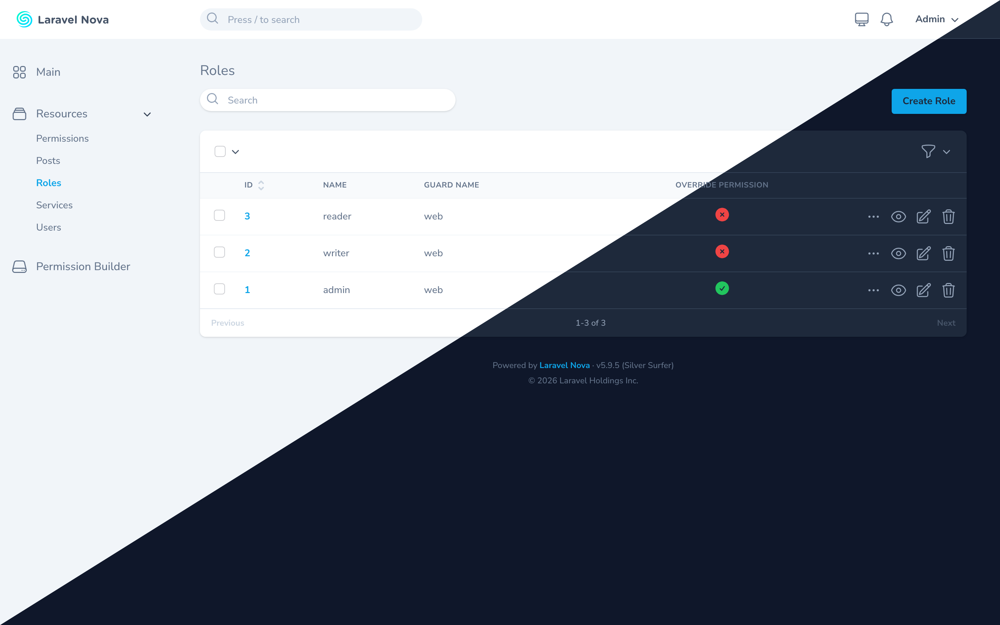

# Laravel Nova permission tool

[](https://packagist.org/packages/bbs-lab/nova-permission)
[](LICENSE.md)
[](https://github.com/BBS-Lab/nova-permission/actions/workflows/run-tests.yml)
[](https://github.com/BBS-Lab/nova-permission/actions/workflows/phpstan.yml)
[](https://packagist.org/packages/bbs-lab/nova-permission)

Based on [spatie/permission](https://github.com/spatie/laravel-permission), this tool gives you ability to manage roles and permission. The tool provides permission builder.



## Contents

- [Requirements](#requirements)
- [Installation](#installation)
- [Usage](#usage)
    - [Generate permissions](#generate-permissions)
    - [Protect resources](#protect-resources)
    - [Granular permissions](#granular-permissions)
    - [Caching](#caching)
    - [Super admin](#super-admin)
- [Testing](#testing)
- [Changelog](#changelog)
- [Security](#security)
- [Contributing](#contributing)
- [Credits](#credits)
- [License](#license)

## Requirements

- PHP `^8.2`
- Laravel Nova `^4.0 || ^5.0`
- spatie/laravel-permission `^6.0`
- Laravel `^11.0 || ^12.0 || ^13.0`

Both Nova majors are exercised in CI. Note that **Nova 4** (through its `inertiajs/inertia-laravel`
dependency) tops out at **PHP 8.4** and **Laravel 11**; on PHP 8.5 or Laravel 12+, use Nova 5. Composer
resolves the right combination for you.

## Installation

To get started, you will need to install the following dependencies


``` bash
composer require bbs-lab/nova-permission
```

The service provider will automatically get registered. Or you may manually add the service provider in your `config/app.php` file:

```php
'providers' => [
    // ...
    BBSLab\NovaPermission\NovaPermissionServiceProvider::class,
],
```

Publish Spatie's permission migration (the base `permissions`/`roles` tables):

```bash
php artisan vendor:publish --provider="Spatie\Permission\PermissionServiceProvider" --tag="permission-migrations"
```

This package's own migrations (which add the `group` + polymorphic `authorizable` columns and the `override_permission` flag) run automatically with `php artisan migrate` — you do not need to publish them.

You can publish the config files with:

```bash
php artisan vendor:publish --tag="nova-permission-config"
```

This publishes two files. `config/permission.php` is [Spatie's standard configuration](https://spatie.be/docs/laravel-permission) — the only change this package needs is to point the two model bindings at its own models (which implement the package contracts):

```php
// config/permission.php (only the keys this package changes; the rest is Spatie's default)
return [

    'models' => [

        /*
         * When using the "HasPermissions" trait from this package, we need to know which
         * Eloquent model should be used to retrieve your permissions. Of course, it
         * is often just the "Permission" model but you may use whatever you like.
         *
         * The model you want to use as a Permission model needs to implement the
         * `BBSLab\NovaPermission\Contracts\Permission` contract.
         */

        'permission' => BBSLab\NovaPermission\Models\Permission::class,

        /*
         * When using the "HasRoles" trait from this package, we need to know which
         * Eloquent model should be used to retrieve your roles. Of course, it
         * is often just the "Role" model but you may use whatever you like.
         *
         * The model you want to use as a Role model needs to implement the
         * `BBSLab\NovaPermission\Contracts\Role` contract.
         */

        'role' => BBSLab\NovaPermission\Models\Role::class,

    ],

    // `table_names`, `column_names`, `display_permission_in_exception` and `cache`
    // keep Spatie's defaults — leave them as published unless you have a reason to change them.
];
```

```php
// config/nova-permission.php
return [
    // Resources whose individual records can carry their own permissions
    // (see "Granular permissions" below). Leave empty if you only use
    // general, model-wide permissions.
    'authorizable_models' => [
        // \App\Nova\Post::class,
    ],

    // Resources excluded from `nova-permission:generate`.
    'generate_without_resources' => [
        \Laravel\Nova\Actions\ActionResource::class,
    ],

    // Authorization gate cache. Disabled by default — enable it only when the
    // read volume justifies it and you accept the staleness window (entries are
    // invalidated on permission save/delete). `ttl` is the lifetime in seconds.
    'cache' => [
        'enabled' => env('NOVA_PERMISSION_CACHE', false),
        'ttl' => env('NOVA_PERMISSION_CACHE_TTL', 60 * 60),
    ],
];
```

Then create the tables by running the migrations (Spatie's published migration plus this package's auto-registered ones):

```bash
php artisan migrate
```

## Usage

You must register the tool with Nova. This is typically done in the `tools` method of the `NovaServiceProvider`:

```php
// app/Providers/NovaServiceProvider.php
<?php

use BBSLab\NovaPermission\PermissionBuilder;
use Laravel\Nova\NovaApplicationServiceProvider;

class NovaServiceProvider extends NovaApplicationServiceProvider
{
    // ..
    
    public function tools()
    {
        return [
            // ...
            PermissionBuilder::make(),
            // You may add some access control
            PermissionBuilder::make()->canSee(function ($request) {
                return $request->user()->hasRole('admin');            
            }),
        ];
    }
}
```

### Prepare your User model

On your authenticatable model, use **this package's** `HasRoles` trait (not Spatie's) and implement the `CanOverridePermission` contract. The package trait adds the per-instance `hasPermissionToOnModel()` method the policies rely on, and the contract powers the super-admin (`override_permission`) feature:

```php
namespace App\Models;

use BBSLab\NovaPermission\Contracts\CanOverridePermission;
use BBSLab\NovaPermission\Traits\HasRoles;
use Illuminate\Foundation\Auth\User as Authenticatable;

class User extends Authenticatable implements CanOverridePermission
{
    use HasRoles;
}
```

> [!IMPORTANT]
> Use `BBSLab\NovaPermission\Traits\HasRoles`, **not** `Spatie\Permission\Traits\HasRoles`. The Nova policies call `hasPermissionToOnModel()`, which exists only on the package trait — with Spatie's trait every protected resource throws `Call to undefined method`.

### Generate permissions

The tool allow to generate resource permissions. Your resources must implement `BBSLab\NovaPermission\Contracts\HasAbilities` and define the public static `$permissionsForAbilities` variable :


```php
namespace App\Nova;

use BBSLab\NovaPermission\Contracts\HasAbilities;
use BBSLab\NovaPermission\Traits\Authorizable;

class Post extends Resource implements HasAbilities
{
    use Authorizable;

    public static $permissionsForAbilities = [
//        'policy action' => 'display name'
        'create' => 'create post',
    ];
}
```

This configuration will generate the following permission:

```php
[
    'name' => 'create post',
    'group' => 'Post', // class basename of the model
    'guard_name' => 'web', // the nova guard or default auth guard
]
```

You may generate permission from the permission builder tool with the `Generate permissions` button or the Artisan command:

```bash
php artisan nova-permission:generate
```

### Protect resources

You may use authorization policies and extend the provided `BBSLab\NovaPermission\Policies\Policy` class

```php
namespace App\Policies;

use App\Models\Post;
use BBSLab\NovaPermission\Policies\Policy;
use Illuminate\Contracts\Auth\Access\Authorizable;

class PostPolicy extends Policy
{
    protected function model(): string
    {
        return Post::class;
    }
}
```

> [!IMPORTANT]  
> You must create a policy for each model you want to protect else the [default permissions](https://nova.laravel.com/docs/resources/authorization.html#undefined-policy-methods) will be applied!

The base `Policy` class takes care of the following actions for you :

- viewAny
- view
- create
- update
- replicate
- delete
- restore
- forceDelete

You are free to add or update methods.

### Granular permissions

Permissions come in two flavours:

- **General** — a model-wide permission (the row's `authorizable` is `null`). "Can this user view *posts*?"
- **Granular** — a permission scoped to one specific record via a polymorphic `authorizable` relation. "Can this user view *this* post?"

The two are resolved with an **instance-override** rule:

> An instance that carries a granular permission is governed by that permission **alone**. An instance with no granular permission falls back to the general permission.

So granting `view service` generally lets a user view every service, until a granular `view service` is attached to a particular service — from then on that one service is gated by the granular grant only, while the rest keep following the general one.

To make a model's individual records authorizable, implement `BBSLab\NovaPermission\Contracts\HasAuthorizations` and use the `BBSLab\NovaPermission\Traits\Authorizations` trait:

```php
namespace App\Models;

use BBSLab\NovaPermission\Contracts\HasAuthorizations;
use BBSLab\NovaPermission\Traits\Authorizations;
use Illuminate\Database\Eloquent\Model;

class Service extends Model implements HasAuthorizations
{
    use Authorizations;
}
```

Register the Nova resource in `config/nova-permission.php` so the builder lets you attach permissions to individual records:

```php
'authorizable_models' => [
    \App\Nova\Service::class,
],
```

You can now create a permission scoped to a specific service:



> [!TIP]
> To create the granular permission automatically whenever a record is created, use an [observer](https://laravel.com/docs/eloquent#observers).

Because the base `Policy` already routes per-instance abilities (`view`, `update`, `delete`, …) through `hasPermissionToOnModel()`, a policy that maps the ability name to the permission needs **no extra code** — the instance-override rule is applied for you. You only override a policy method when the granular permission has a *different* name than the ability:

```php
namespace App\Policies;

use App\Models\Service;
use BBSLab\NovaPermission\Policies\Policy;
use Illuminate\Contracts\Auth\Access\Authorizable;
use Illuminate\Database\Eloquent\Model;

class ServicePolicy extends Policy
{
    protected function model(): string
    {
        return Service::class;
    }

    // The parameter type must stay `Model` to match the base Policy signature
    // (PHP forbids narrowing it to Service); the instance is your Service.
    public function view(Authorizable $user, Model $service): ?bool
    {
        if ($user->hasPermissionToOnModel('view secret service', $service)) {
            return true;
        }

        return null;
    }
}
```

#### Filtering an index by permission

To list only the records a user may act on, apply the `authorize` query scope (provided by the `Authorizations` trait). It mirrors the instance-override rule and honours `override_permission` roles:

```php
Service::query()->authorize($request->user(), 'view service')->get();
```

### Caching

Gate checks are **not** cached by default. Enable the cache from `config/nova-permission.php` (or the `NOVA_PERMISSION_CACHE` env flag) once read volume justifies it. Cached entries are invalidated when a permission is saved or deleted; see the config comments for the staleness caveats.

### Super admin

You may want to create a role as super admin. You can do that using the `override_permission` attribute.



You may prevent `override_permission` attribute modification by using the `BBSLab\NovaPermission\Resources\Role::canSeeOverridePermmission` method:

```php
// in a service provider

BBSLab\NovaPermission\Resources\Role::canSeeOverridePermmission(function (Request $request) {
    // implement your logic
});
``` 

## Testing

The package ships a runnable Nova workbench that doubles as a manual playground and a demo of every feature:

```bash
composer serve   # boots Nova at http://127.0.0.1:8000/nova
```

Log in with `admin@laravel.com` / `password` (also seeded: `writer@laravel.com`, `reader@laravel.com`, same password). The workbench seeds roles, a `Post` and `Service` resource showcasing general vs granular permissions, and Nova impersonation so you can switch between the seeded users without logging out.

The quality gate:

```bash
composer test           # Pest
composer test-coverage  # Pest with 100% line coverage on src/
composer analyse        # PHPStan level 8
composer format         # Pint
```

Front-end work additionally uses `npm run package` (Prettier + ESLint + Vite build).

## Changelog

Please see [CHANGELOG](CHANGELOG.md) for more information on what has changed recently, and [UPGRADE](UPGRADE.md) for the 1.x → 2.0 migration.

## Security

If you discover any security related issues, please email paris@big-boss-studio.com instead of using the issue tracker.

## Contributing

Please see [CONTRIBUTING](CONTRIBUTING.md) for details.

## Credits

- [Big Boss Studio](https://github.com/BBS-Lab)
- [All Contributors](../../contributors)

## License

The MIT License (MIT). Please see [License File](LICENSE.md) for more information.
