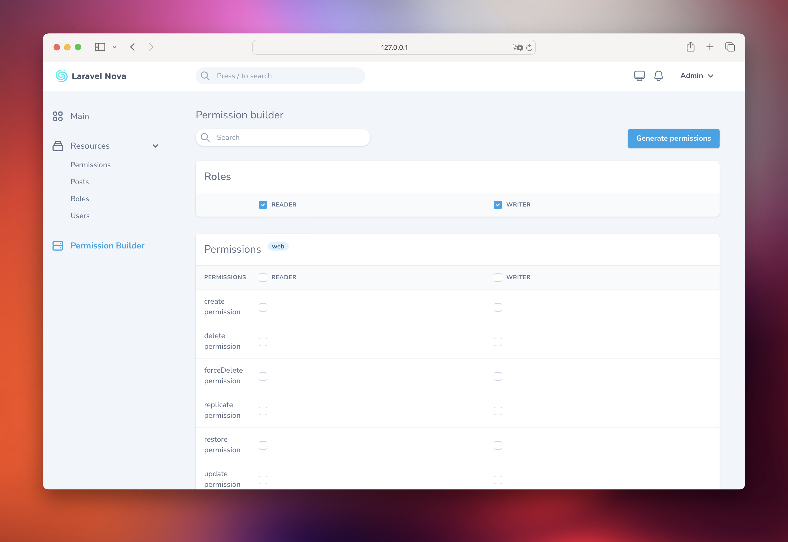
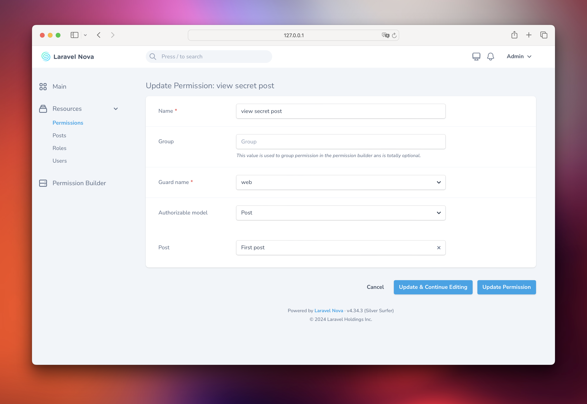
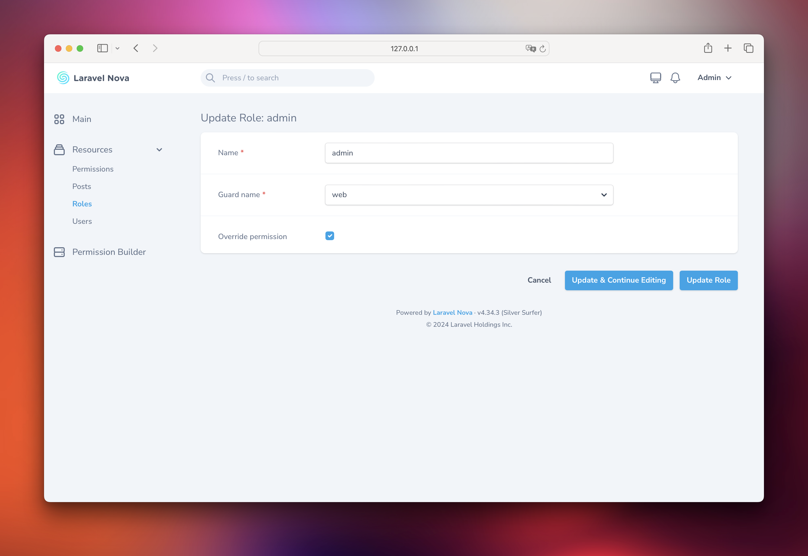

# Laravel Nova permission tool

[](https://packagist.org/packages/bbs-lab/nova-permission)
[](LICENSE.md)
[](https://styleci.io/repos/220784911)
[](https://scrutinizer-ci.com/g/bbs-lab/nova-permission)
[](https://packagist.org/packages/bbs-lab/nova-permission)

Based on [spatie/permission](https://github.com/spatie/laravel-permission), this tool gives you ability to manage roles and permission. The tool provides permission builder.



## Contents

- [Installation](#installation)
- [Usage](#usage)
    - [Generate permissions](#generate-permissions)
    - [Protect resources](#protect-resources)
    - [Super admin](#super-admin)
- [Changelog](#changelog)
- [Security](#security)
- [Contributing](#contributing)
- [Credits](#credits)
- [License](#license)

## Installation

To get started, you will need to install the following dependencies


``` bash
composer require bbs-lab/nova-permission
```

The service provider will automatically get registered. Or you may manually add the service provider in your `config/app.php` file:

```php
'providers' => [
    // ...
    BBSLab\NovaPermission\NovaPermissionServiceProvider::class,
],
```

You should publish the migrations with:

```bash
php artisan vendor:publish --provider="Spatie\Permission\PermissionServiceProvider" --tag="migrations"

php artisan vendor:publish --provider="BBSLab\NovaPermission\NovaPermissionServiceProvider" --tag="migrations"
```

You can publish the config files with:

```bash
php artisan vendor:publish --provider="BBSLab\NovaPermission\NovaPermissionServiceProvider" --tag="config"
```

This will publish `config/permission.php` and `config/nova-permission.php` files with the following contents:

```php
// config/permission.php
return [

    'models' => [

        /*
         * When using the "HasPermissions" trait from this package, we need to know which
         * Eloquent model should be used to retrieve your permissions. Of course, it
         * is often just the "Permission" model but you may use whatever you like.
         *
         * The model you want to use as a Permission model needs to implement the
         * `BBSLab\NovaPermission\Contracts\Permission` contract.
         */

        'permission' => BBSLab\NovaPermission\Models\Permission::class,

        /*
         * When using the "HasRoles" trait from this package, we need to know which
         * Eloquent model should be used to retrieve your roles. Of course, it
         * is often just the "Role" model but you may use whatever you like.
         *
         * The model you want to use as a Role model needs to implement the
         * `BBSLab\NovaPermission\Contracts\Role` contract.
         */

        'role' => BBSLab\NovaPermission\Models\Role::class,

    ],

    'table_names' => [

        /*
         * When using the "HasRoles" trait from this package, we need to know which
         * table should be used to retrieve your roles. We have chosen a basic
         * default value but you may easily change it to any table you like.
         */

        'roles' => 'roles',

        /*
         * When using the "HasPermissions" trait from this package, we need to know which
         * table should be used to retrieve your permissions. We have chosen a basic
         * default value but you may easily change it to any table you like.
         */

        'permissions' => 'permissions',

        /*
         * When using the "HasPermissions" trait from this package, we need to know which
         * table should be used to retrieve your models permissions. We have chosen a
         * basic default value but you may easily change it to any table you like.
         */

        'model_has_permissions' => 'model_has_permissions',

        /*
         * When using the "HasRoles" trait from this package, we need to know which
         * table should be used to retrieve your models roles. We have chosen a
         * basic default value but you may easily change it to any table you like.
         */

        'model_has_roles' => 'model_has_roles',

        /*
         * When using the "HasRoles" trait from this package, we need to know which
         * table should be used to retrieve your roles permissions. We have chosen a
         * basic default value but you may easily change it to any table you like.
         */

        'role_has_permissions' => 'role_has_permissions',
    ],

    'column_names' => [

        /*
         * Change this if you want to name the related model primary key other than
         * `model_id`.
         *
         * For example, this would be nice if your primary keys are all UUIDs. In
         * that case, name this `model_uuid`.
         */

        'model_morph_key' => 'model_id',
    ],

    /*
     * When set to true, the required permission/role names are added to the exception
     * message. This could be considered an information leak in some contexts, so
     * the default setting is false here for optimum safety.
     */

    'display_permission_in_exception' => false,

    'cache' => [

        /*
         * By default all permissions are cached for 24 hours to speed up performance.
         * When permissions or roles are updated the cache is flushed automatically.
         */

        'expiration_time' => \DateInterval::createFromDateString('24 hours'),

        /*
         * The cache key used to store all permissions.
         */

        'key' => 'spatie.permission.cache',

        /*
         * When checking for a permission against a model by passing a Permission
         * instance to the check, this key determines what attribute on the
         * Permissions model is used to cache against.
         *
         * Ideally, this should match your preferred way of checking permissions, eg:
         * `$user->can('view-posts')` would be 'name'.
         */

        'model_key' => 'name',

        /*
         * You may optionally indicate a specific cache driver to use for permission and
         * role caching using any of the `store` drivers listed in the cache.php config
         * file. Using 'default' here means to use the `default` set in cache.php.
         */

        'store' => 'default',
    ],
];
```

```php
// config/nova-permission
return [
    'authorizable_models' => [
        // \App\Models\Post::class,
    ],

    'generate_without_resources' => [
        \Laravel\Nova\Actions\ActionResource::class,
        \BBSLab\NovaPermission\Resources\Role::class,
        \BBSLab\NovaPermission\Resources\Permission::class,
    ]
];
```

After the migration has been published you can create the role and permission tables by running the migrations :

```bash
php artisan migrate
```

## Usage

You must register the tool with Nova. This is typically done in the `tools` method of the `NovaServiceProvider`:

```php
// app/Providers/NovaServiceProvider.php
<?php

use BBSLab\NovaPermission\PermissionBuilder;
use Laravel\Nova\NovaApplicationServiceProvider;

class NovaServiceProvider extends NovaApplicationServiceProvider
{
    // ..
    
    public function tools()
    {
        return [
            // ...
            PermissionBuilder::make(),
            // You may add some access control
            PermissionBuilder::make()->canSee(function ($request) {
                return $request->user()->hasRole('admin');            
            }),
        ];
    }
}
```

### Generate permissions

The tool allow to generate resource permissions. Your resources must implement `BBSLab\NovaPermission\Contracts\HasAbilities` and define the public static `$permissionsForAbilities` variable :


```php
namespace App\Nova;

use BBSLab\NovaPermission\Contracts\HasAbilities;
use BBSLab\NovaPermission\Concerns\Authorizable;

class Post extends Resource implements HasAbilities
{
    use Authorizable;

    public static $permissionsForAbilities = [
//        'policy action' => 'display name'
        'create' => 'create post',
    ];
}
```

This configuration will generate the following permission:

```php
[
    'name' => 'create post',
    'group' => 'Post', // class basename of the model
    'guard_name' => 'web', // the nova guard or default auth guard
]
```

You may generate permission from the permission builder tool with the `Generate permissions` button or the Artisan command:

```bash
php artisan nova-permission:generate
```

### Protect resources

You may use authorization policies and extend the provided `BBSLab\NovaPermission\Policies\Policy` class

```php
namespace App\Policies;

use App\Models\Post;
use BBSLab\NovaPermission\Policies\Policy;
use Illuminate\Contracts\Auth\Access\Authorizable;

class PostPolicy extends Policy
{
    protected function model(): string
    {
        return Post::class;
    }
}
```

> [!IMPORTANT]  
> You must create a policy for each model you want to protect else the [default permissions](https://nova.laravel.com/docs/resources/authorization.html#undefined-policy-methods) will be applied!

The base `Policy` class takes care of the following actions for you :

- viewAny
- view
- create
- update
- replicate
- delete
- restore
- forceDelete

You are free to add or update methods.

Sometimes you may want to protect a particular resource. First the model must implement the `BBSLab\NovaPermission\Contracts\HasAuthorizations` interface and use the `BBSLab\NovaPermission\Traits\Authorizations` trait :

```php
namespace App\Models;

use BBSLab\NovaPermission\Contracts\HasAuthorizations;
use BBSLab\NovaPermission\Traits\Authorizations;

class Post extends Model implements HasAuthorizations 
{
    use Authorizations;
}
```

You need to add the resource in the `config/nova-permission.php`:

```php
'authorizable_models' => [
    \App\Nova\Post::class,
],
```

You can now create a permission for a specific post:



> [!TIP]
> If you want to have custom permissions for each model you create you can create an [observer](https://laravel.com/docs/11.x/eloquent#observers) to create the permission automatically.

And update the post policy:

 ```php
namespace App\Policies;

use App\Models\Post;use BBSLab\NovaPermission\Policies\Policy;use Illuminate\Contracts\Auth\Access\Authorizable;

class PostPolicy extends Policy
{
    protected function model(): string
    {
        return Post::class;
    }
    
    public function view(Authorizable $user, Post $post)
    {
        if ($user->hasPermissionToOnModel('view secret post', $post)) {
            return true;
        }
    }
}
```

> [!TIP]
> If you create a custom permission for a model which is named like a [Nova action](https://nova.laravel.com/docs/resources/authorization.html#policies) (e.g. `view`) you don't need to update your policy.

### Super admin

You may want to create a role as super admin. You can do that using the `override_permission` attribute.



You may prevent `override_permission` attribute modification by using the `BBSLab\NovaPermission\Resources\Role::canSeeOverridePermmission` method:

```php
// in a service provider

BBSLab\NovaPermission\Resources\Role::canSeeOverridePermmission(function (Request $request) {
    // implement your logic
});
``` 

## Changelog

Please see [CHANGELOG](CHANGELOG.md) for more information what has changed recently.

## Security

If you discover any security related issues, please email paris@big-boss-studio.com instead of using the issue tracker.

## Contributing

Please see [CONTRIBUTING](CONTRIBUTING.md) for details.

## Credits

- [Mikaël Popowicz](https://github.com/mikaelpopowicz)
- [All Contributors](../../contributors)

## License

The MIT License (MIT). Please see [License File](LICENSE.md) for more information.
